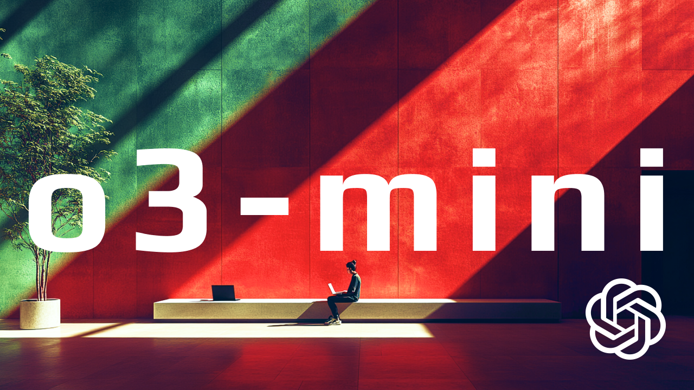
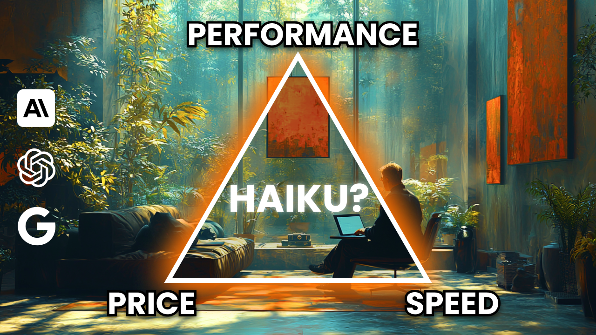

# BENCHY
> Benchmarks you can **feel**
>
> We all love benchmarks, but there's nothing like a hands on vibe check. What if we could meet somewhere in the middle?
> 
> Enter BENCHY. A chill, live benchmark tool that lets you see the performance, price, and speed of LLMs in a side by side comparison for SPECIFIC use cases.
>
> Watch the latest development [video here](https://youtu.be/K5xs669ANQo)






## Benchy Micro Apps
- [Thought Bench](https://youtu.be/UgSGtBZnwEo)
  - Goal: Compare multiple reasoning models (Deepseek R1, Gemini 2.0 Flash Thinking, OpenAI o1, ,etc) thoughts side by side in parallel.
  - Watch the walk through [video here](https://youtu.be/UgSGtBZnwEo)
  - Front end: [src/pages/ThoughtBench.vue](src/pages/ThoughtBench.vue)
- [BIG AI Coding Updates to Benchy](https://youtu.be/y_ywOVQyafE)
  - Watch the walk through [video here](https://youtu.be/y_ywOVQyafE)
- [Iso Speed Bench](https://youtu.be/OwUm-4I22QI)
  - Goal: Create a unified, config file based, multi-llm provider, yes/no evaluation based benchmark for high quality insights and iteration.
  - Watch o3-mini vibe check, comparison, and benchmark [video here](https://youtu.be/K5xs669ANQo)
  - Watch the M4 Unboxing and benchmark [video here](https://youtu.be/OwUm-4I22QI)
  - Front end: [src/pages/IsoSpeedBench.vue](src/pages/IsoSpeedBench.vue)
- [Long Tool Calling](https://youtu.be/ZlljCLhq814)
  - Goal: Understand the best LLMs and techniques for LONG chains of tool calls / function calls (15+).
  - Watch the walk through [video here](https://youtu.be/ZlljCLhq814)
  - Front end: [src/pages/AppMultiToolCall.vue](src/pages/AppMultiToolCall.vue)
- [Multi Autocomplete](https://youtu.be/1ObiaSiA8BQ)
  - Goal: Understand [claude 3.5 haiku](https://www.anthropic.com/claude/haiku) & GPT-4o [predictive outputs](https://platform.openai.com/docs/guides/predicted-outputs) compared to existing models. 
  - Watch the walk through [video here](https://youtu.be/1ObiaSiA8BQ)
  - Front end: [src/pages/AppMultiAutocomplete.vue](src/pages/AppMultiAutocomplete.vue)
## Important Files
- `.env` - Environment variables for API keys
- `server/.env` - Environment variables for API keys
- `package.json` - Front end dependencies
- `server/pyproject.toml` - Server dependencies
- `src/store/*` - Stores all front end state and prompt
- `src/api/*` - API layer for all requests
- `src/pages/*` - Front end per app pages
- `src/components/*` - Front end components
- `server/server.py` - Server routes
- `server/modules/llm_models.py` - All LLM models
- `server/modules/openai_llm.py` - OpenAI LLM
- `server/modules/anthropic_llm.py` - Anthropic LLM
- `server/modules/gemini_llm.py` - Gemini LLM
- `server/modules/ollama_llm.py` - Ollama LLM
- `server/modules/deepseek_llm.py` - Deepseek LLM
- `server/benchmark_data/*` - Benchmark data
- `server/reports/*` - Benchmark results

## Setup

### Get API Keys & Models
- [Anthropic](https://docs.anthropic.com/en/api/getting-started)
- [Google Cloud](https://ai.google.dev/gemini-api/docs/api-key)
- [OpenAI](https://help.openai.com/en/articles/4936850-where-do-i-find-my-openai-api-key)
- [Deepseek](https://platform.deepseek.com/)
- [Ollama](https://ollama.ai/download)
  - After installing Ollama, pull the required models:
  ```bash
  # Pull Llama 3.2 1B model
  ollama pull llama3.2:1b
  
  # Pull Llama 3.2 latest (3B) model
  ollama pull llama3.2:latest
  
  # Pull Qwen2.5 Coder 14B model
  ollama pull qwen2.5-coder:14b

  # Pull Deepseek R1 1.5B, 7b, 8b, 14b, 32b, 70b models
  ollama pull deepseek-r1:1.5b
  ollama pull deepseek-r1:latest
  ollama pull deepseek-r1:8b
  ollama pull deepseek-r1:14b
  ollama pull deepseek-r1:32b
  ollama pull deepseek-r1:70b

  # Pull mistral-small 3
  ollama pull mistral-small:latest
  ```

### Client Setup
```bash
# Install dependencies using bun (recommended)
bun install

# Or using npm
npm install

# Or using yarn
yarn install

# Start development server
bun dev  # or npm run dev / yarn dev
```

### Server Setup
```bash
# Move into server directory
cd server

# Create and activate virtual environment using uv
uv sync

# Set up environment variables
cp .env.sample .env (client)
cp server/.env.sample server/.env (server)

# Set EVERY .env key with your API keys and settings
ANTHROPIC_API_KEY=
OPENAI_API_KEY=
GEMINI_API_KEY=
DEEPSEEK_API_KEY=
FIREWORKS_API_KEY=

# Start server
uv run python server.py

# Run tests
uv run pytest (**beware will hit APIs and cost money**)
```

## Resources
- https://github.com/simonw/llm?tab=readme-ov-file
- https://github.com/openai/openai-python
- https://platform.openai.com/docs/guides/predicted-outputs
- https://community.openai.com/t/introducing-predicted-outputs/1004502
- https://unocss.dev/integrations/vite
- https://www.npmjs.com/package/vue-codemirror6
- https://vuejs.org/guide/scaling-up/state-management
- https://www.ag-grid.com/vue-data-grid/getting-started/
- https://www.ag-grid.com/vue-data-grid/value-formatters/
- https://llm.datasette.io/en/stable/index.html
- https://cloud.google.com/vertex-ai/generative-ai/docs/multimodal/get-token-count
- https://ai.google.dev/gemini-api/docs/tokens?lang=python
- https://ai.google.dev/pricing#1_5flash
- https://ai.google.dev/gemini-api/docs/structured-output?lang=python
- https://platform.openai.com/docs/guides/structured-outputs
- https://docs.anthropic.com/en/docs/build-with-claude/tool-use
- https://ai.google.dev/gemini-api/docs/models/experimental-models
- https://sqlparse.readthedocs.io/en/latest/intro.html
- mlx: https://huggingface.co/mlx-community
- ollama docs: https://github.com/ollama/ollama/blob/main/docs/api.md#examples
- deepseek docs: https://platform.deepseek.com/usage